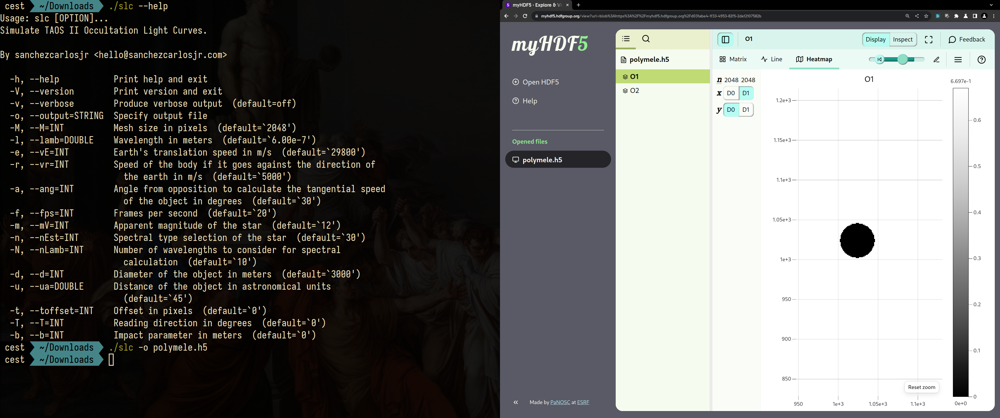

# Occultation light curve simulator

The Trans-Neptunian Automated Occultation Survey II (TAOS II) event simulator is a valuable tool for modeling and predicting occultation events caused by small objects in the Kuiper Belt and beyond. Integrating this simulator into machine learning (ML) pipelines can indeed provide significant insights. Generating synthetic data or simulating rare events, can help train ML models to better detect and analyze actual astronomical observations, enhancing the accuracy of object detection and characterization in space.



# Playground
Learn how to install and use the program through this [playground](https://colab.research.google.com/drive/1GCPLfTBvZLvwUEgk9O1yfWWH1MQAXUHs?usp=sharing).

# Installation

## Docker

1. Build the Docker image.
```
docker build -t slc .
```

2. Run the Docker container with the results directory mounted as a volume.
```
docker run -v ./results:/data slc -o x.h5
```

ProTip: Create an alias to run the Docker container to make it easier to use.
```
alias slc='docker run -v ./results:/data slc'
```

## Arch Linux (AUR)

1. Install the AUR package
```
yay -S slc-bin
```

## Linux
1. Install fftw, gsl and hdf5.

For example, on Arch Linux, you would run
```
sudo pacman -S fftw gsl hdf5
```

2. Download the [latest version](https://github.com/sanchezcarlosjr/occultation_light_curves/releases/latest/download/slc) from GitHub Releases, so you don't need to compile the repository; it just works.


# Usage
Start your simulation with default parameters and save your data into HDF5.

```bash
slc -o polymele.h5
```

## Available commands
```slc``` supports several options, each accessible through the ```slc``` command and through our library. For help on individual commands, add --help following the command name. The commands are available on [here](./cli/cli.ggo).


## HDF5 Viewers

You can view your data using HDF5 viewers such as [myhdf5](https://myhdf5.hdfgroup.org/).
